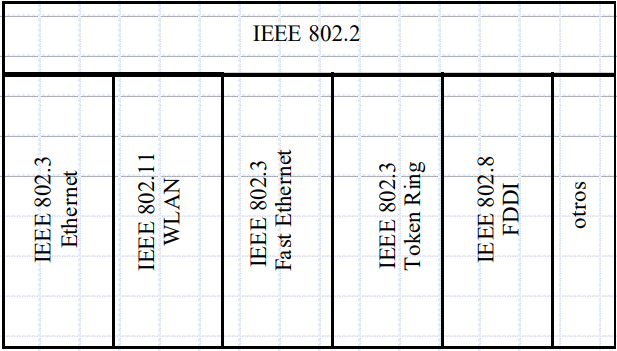

# CAPA DE ENLACE

<h3>Se encarga de:</h3>

- Sincroniza las tramas, donde acaba y comienza cada bloque de información
- Manejar los errores de transmisión, siempre hay errores y se encarga de amortiguarlos
- Regular el flujo de datos, para adaptar las diferentes velocidades de transferencia de las máquinas
- Control de acceso al medio, se encarga del direccionamiento

<h3>Arquitectura IEEE</h3>

- Se subdivide en:
    - Subcapa LLC
        - Control de errores
        - Control de flujo
    - Subcapa MAC
        - Control de acceso al medio
        - Sincronización de tramas
- Estándares actuales:

<h3>ENTRAMADO</h3>

- Entramado se refiere a la conexión de 2 dispositivos para la comunicación a nivel de enlace
- Se subdivide en:
    - Capa física
        - 1 flujo de bit
        - Siempre tiene errores
    - Capa de enlace
        - Divide el flujo de bits en una serie de tramas
        - Añade información redundante
        - Se comprueba si es correcta en el endpoint
- Algunas soluciones:
    - Dejar espacio entre las tramas
        - Problemas de temporalización
    - Conteo de caracteres
        - Cuenta el número de caracteres de la trama, para enviar en la cabecera
        - Se puede perder el entramado si se produce un error de transmisión
        - No se utiliza actualmente
    - Banderas, con relleno de caracteres
        - Se establecen unos bytes especiales al principio y al final de la trama, que denominamos flags
        - El problema es que en la carga útil se encuentra la misma secuencia de bytes especiales FLAG
        - Otro problema es que se utiliza relleno de caracteres ESC, por lo que pueden encontrarse en la secuencia de datos
    - Banderas, con relleno de bit
        - Se utiliza la siguiente FLAG al principio y al final de la trama: 01111110
        - Un problema que tiene es si la bandera se encuentra en la carga útil
        - Otro problema es cuando se encuentran 5 1s en el flujo de bit, se inserta automáticamente un 0
    - Violación de codificación de la capa física
        - Solo aplicable a redes con un medio físico situacional
        - 1 alto-bajo
        - 0 bajo-alto
        - Utilizar el 1 y el 0 para delimitar la trama

<h3>CONTROL DE ERRORES</h3>

- La capa física siempre es susceptible al error en la transmisión de los bits
- Existen 2 métodos de control de errores:
    - FEC(Forward Error Correction): Recupera información original sobre la marcha
    - ARQ(Automatic Repeat Request): Detectar errores y solicitar la retransmisión de los datos
- 

<h3>TIPOS DE MENSAJES DEL NIVEL DE ENLACE</h3>

<ul>
    <li>NO NUMERADOS</li>
        <ol>
            <li>
                SAMB: Inicia la conexión
            </li>
            <li>
                DISC: Desconexión
            </li>
            <li>
                UA: Confirmas conexión o desconexión
            </li>
        </ol>
    <li>NUMERADOS</li>
        <ol>
            <li>
                SREJ: Rechazo selectivo
            </li>
            <li>
                REJ: Rechazo simple
            </li>
            <li>
                RR: Receive ready, se puede usar con flag
            </li>
                <ul>
                    <li>
                        RRP: Pregunta, que obliga a la respuesta
                    </li>
                    <li>
                        RRR: Respueta, obligada por la pregunta
                    </li>
                </ul>
            <li>
                RNR: Receive not ready
            </li>
        </ol>
</ul>
